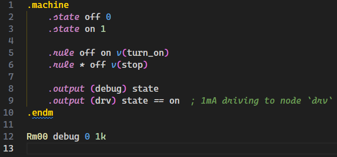

# LTspice Language Support and Netlist Syntax Highlighting for VS Code

Adds syntax highlighting support for LTspice netlist files (`.cir`, `.sp`, etc.) in Visual Studio Code.

## Features

- Basic and dedicated syntax highlighting for LTspice netlist files
- Recognition of circuit components, directives, parameters and other syntax elements
- Supported file extensions: `.cir`, `.sp`, `.ckt`, `.net`, `.sub`, `.lib`

## Installation

1. Open VS Code
2. Go to Extensions view (Ctrl+Shift+X or Cmd+Shift+X)
3. Search for "vscode-ltspice" or your extension name
4. Click Install

Or install directly from [VS Code Marketplace](https://marketplace.visualstudio.com/items?itemName=whyfz399.vscode-ltspice).

## Usage

After installation, VS Code will automatically recognize the following file types and apply syntax highlighting:
- `.cir`, `.ckt` (circuit files)
- `.sp` (SPICE netlists)
- `.net` (netlist files)
- `.sub`, `.lib` (subcircuits and libraries)

Simply open any file with these extensions to see the syntax highlighting in action.

## Supported Functions

- Elements (`A`, `C`, `D`, `J`, `K`, `L`, `M`, `N`, `O`, `Q`, `R`, `S`, `T`, `U`, `W`, `X`, `Z`, `@`, `&`)
- Sources (`B`, `E`, `F`, `G`, `H`, `I`, `V`)
- Directives (`.tran`, `.fra`, `.param`, `.model`, etc.)
- Function blocks (`.subckt`/`.ends`, `.machine`/`.endmach`, etc.)
- The global reference node "GND" (`0`) and numeric literals (`0`, `1e-3`, `10k`, etc.)
- Operators (`+`, `-`, `*`, `/`, `**`, `&`, `|`, `!`, etc.)
- Builtin functions (`i`, `v`, `sin`, `cos`, `exp`, `idt`, `ddt`, `delay`, etc.)
- Comments (line comments starting with `*` or `;`)

## Known Limitations

- Currently provides basic syntax highlighting only (no code completion or error checking)
- Builtin functions up to LTspice 17.1

## Contributing

Issues and pull requests are welcome! Please submit via [GitHub repository](YOUR_REPO_URL).

## Acknowledgement

Many thanks to Xuan Li. This extension starts from Li's work, [SPICE](https://marketplace.visualstudio.com/items?itemName=xuanli.spice), and is adjusted to LTspice.

## License

MIT License
